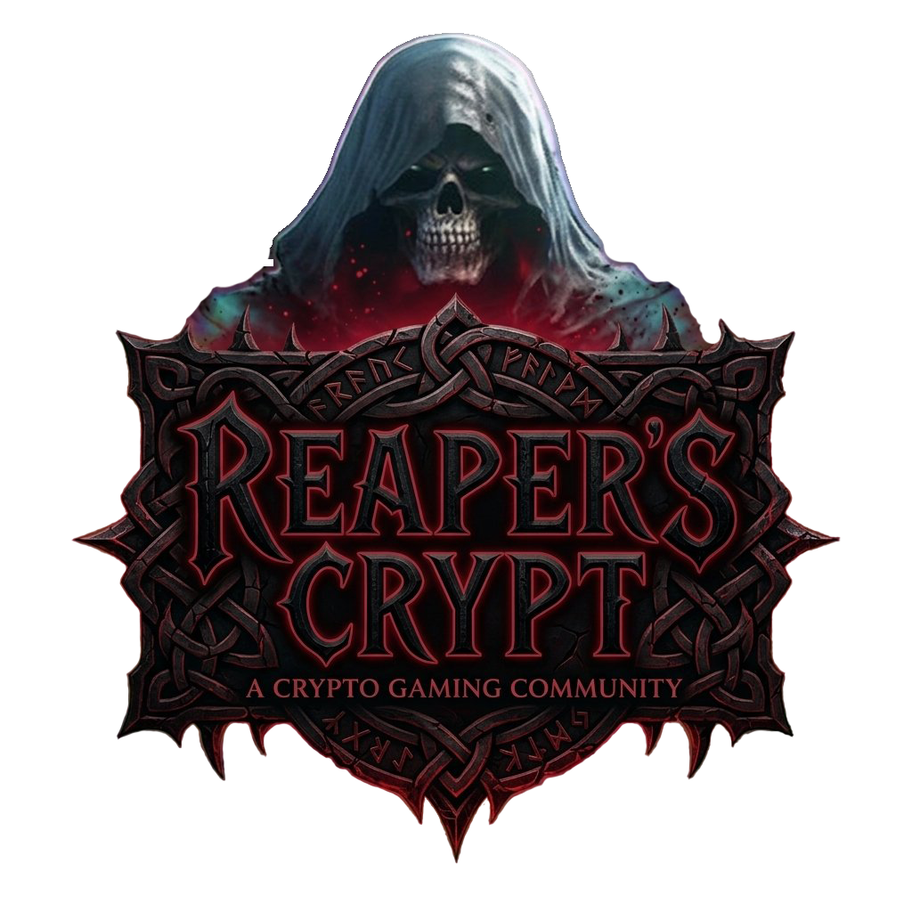
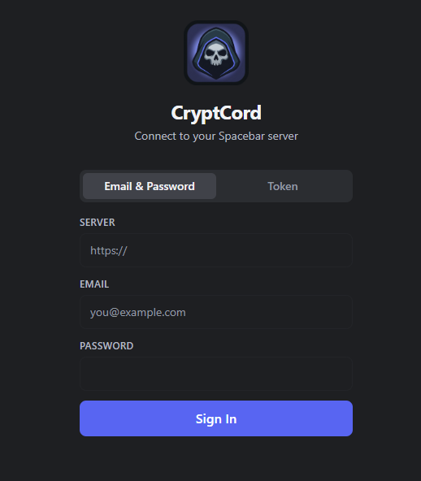
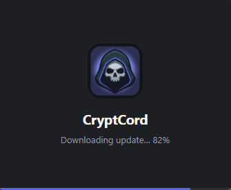
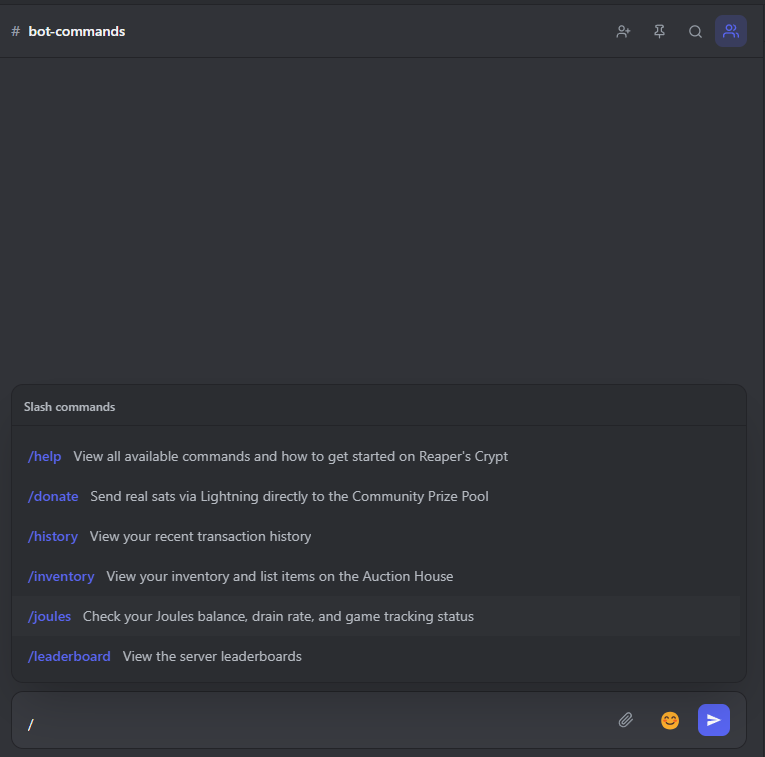
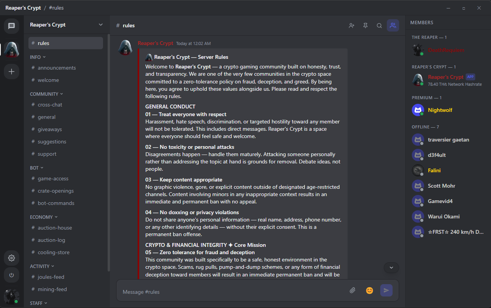
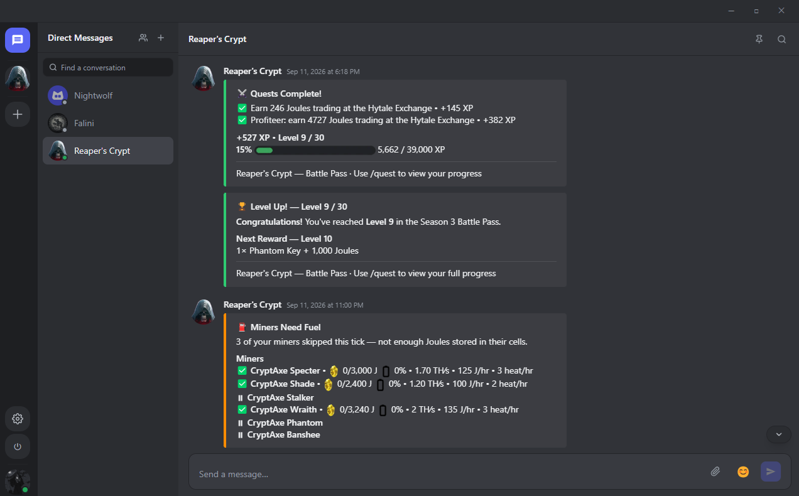

# CryptCord

  

  A native desktop chat client for <a href="https://spacebar.chat">Spacebar</a>-compatible servers, built with Electron and React.

  
  
  

---

  

  CryptCord was built for <a href="https://www.reaperscrypt.com"><strong>Reaper's Crypt</strong></a> — a crypto gaming community running its own Spacebar instance. 
  Free to download and use for anyone running a self-hosted Spacebar server.

---

## Download

| Platform | Link |
|---|---|
| Windows | [Download Installer](https://api.reaperscrypt.com/download/windows) |
| macOS | [Download DMG](https://api.reaperscrypt.com/download/mac) |
| Linux | [Download AppImage](https://api.reaperscrypt.com/download/linux) |

CryptCord checks for updates automatically on every launch. If a new version is available it downloads and installs silently in the background — no prompts required.

---

## Features

- Connect to any Spacebar-compatible server
- Real-time messaging via WebSocket gateway
- Guild and channel navigation
- Markdown and GFM rendering
- Inline image attachments and lightbox
- Reply threading, message editing, and deletion
- Typing indicators
- Emoji reactions
- Create or join servers via invite link
- Slash command support
- Direct messages
- Ctrl+K quick channel switcher
- OS desktop notifications
- Minimize to system tray
- Persistent login session across restarts
- Automatic updates on launch with splash screen and download progress
- Native frameless window with custom titlebar

---

## Screenshots

  
  &nbsp;
  
  &nbsp;
  

  
  &nbsp;
  

---

## Bugs & Feature Requests

Use the [Issues](https://github.com/DeathRequiem/CryptCord-Community/issues) tab to report bugs or suggest new features. Please check for existing issues before opening a new one.
